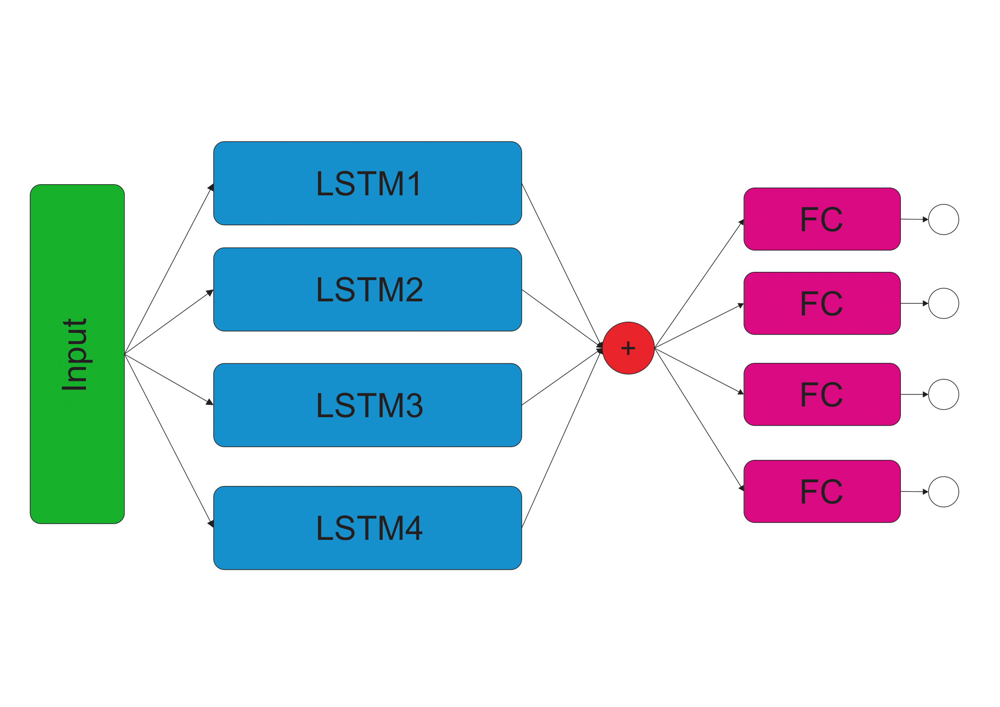

# ML_for_finance
ML for finance forecasting (colab version).

This project was created to test the ability of neural networks to predict the stock market's behavior in stable times, when force majeure events are not significant. Neural networks take into account price periodicity, trends, and correlations between index values. Oil and gas prices, for example, only affect the ruble and the Moscow Exchange index after a certain period of time, and in turn, the ruble and Moscow Exchange affect each other. The author's models use recurrent neural networks and conventional fully connected neural networks, which were built intuitively and adjusted for maximum predictive accuracy based on subjective assessment and the basics of technical market analysis.

## Scientific interest
This project may be useful for specialists in financial analytics or the scientific field. Please refer to the repository when using it.

## Data
The data is downloading from Yahoo Finance and MOEX. 

***Important update: Yahoo Finance no longer displays data from the Russian stock market.  apimoex has been integrated.*** 

## NN architecture
By going through and learning from the basics of technical analysis, the following scheme looks promising 
### NN stack 
PyTorch, Pandas, sklearn, yfinance, LSTM, Multi-Dimensional Regression, apimoex

