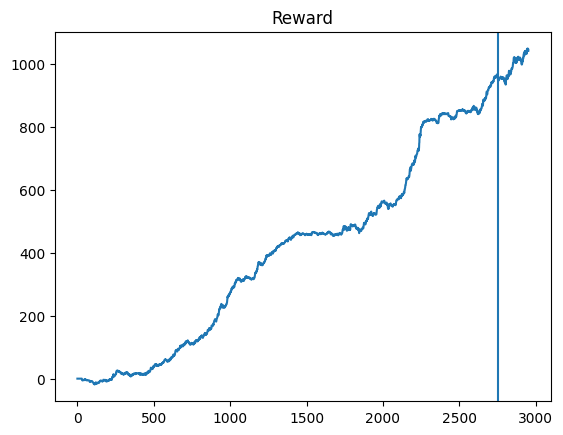

# ML_for_finance
ML for finance forecasting (colab version).

This project was created to test the ability of neural networks to predict the stock market's behavior in stable times, when force majeure events are not significant. Neural networks take into account price periodicity, trends, and correlations between index values. Oil and gas prices, for example, only affect the ruble and the Moscow Exchange index after a certain period of time, and in turn, the ruble and Moscow Exchange affect each other. The author's models use recurrent neural networks and conventional fully connected neural networks, which were built intuitively and adjusted for maximum predictive accuracy based on subjective assessment and the basics of technical market analysis.

## Scientific interest
This project may be useful for specialists in financial analytics or the scientific field. Please refer to the repository when using it.

## Data
The data is downloading from Yahoo Finance and MOEX. 

***Important update: Yahoo Finance no longer displays data from the Russian stock market.  apimoex has been integrated.*** 

## NN architecture with LSTM
By going through and learning from the basics of technical analysis, the following scheme looks promising for a long time 

## Reinforcement learning 
Technical analysis is based on patterns - certain patterns of changes in stock prices and futures. There is a complex system - the *Elliot wave principle* based on Fibonacci numbers. Due to the difficulty of diagnosing patterns using these rules, some analysts win more often and others lose using their interpretations. Machine learning can train on the past, develop relevant rules and use them in games. Reinforcement learning is used for this, when the agent is in the environment, playing and learning.

The challenge is to find the optimal architecture to prevent overfitting. Dropouts can have a negative impact on the performance of an agent. A large neural network learns from the data provided, but it is necessary to manually select the appropriate learning rate and architecture. After that, it is important to test the model with different seeds to ensure accuracy. Only after these steps can the model be used in the market with confidence. 

Reinforcement learning is not so stable, the best model selector has been added. Also the `VOLUME` with MINMAX normalization has been added as the second variable.  

## Brain-inspired Modular Training
Inspired by the structure of the brain, neurons are embedded in a geometric space where distances are defined. We modify the loss function by adding a cost that is proportional to the length of each neuron connection, multiplied by the absolute value of its connection weight. This promotes locality, or the tendency to keep neurons that need to communicate close together. Any Riemannian manifold can be used for this purpose, but we explore 2D and 3D Euclidean spaces for ease of visualization. This approach was proposed by Ziming Liu, Eric Gan and Max Tegmark in https://arxiv.org/abs/2305.08746.

 'BIMT architecture from the article'

We modified our code with RL to lower overfitting, make our NN more compact, to induce Grokking mechanism. Also, we can changed reward cost function 
 $$1, x = 1$$; $$-3, x = -1$$ to make fail less possible. This approach balances the accuracy of neural network predictions and the size of the model. We move the minimization of neural networks to the neural network itself. Instead of memorization, we gain understanding.
 

     
The data augementation has been added $-$ the noise in environment now add a normal distribuited noise for every replay_experience.

### NN stack 
PyTorch, Pandas, sklearn, yfinance, LSTM, Multi-Dimensional Regression, apimoex, reinforcement learning, Brain-inspired Modular Training

